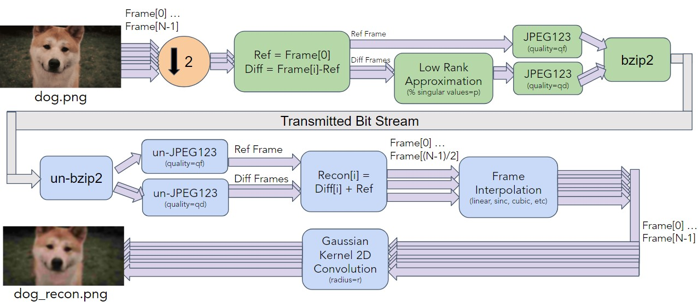
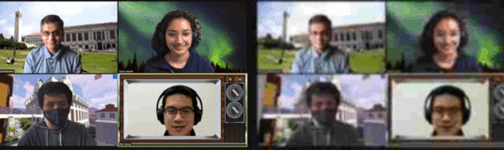

In Berkeley's Digital Signal Processing class (EE 123), we were tasked with creating an animated PNG compression scheme. 

#### Image Compression  
In order to compress GIFs or animated PNGs, we first needed a standard image compression scheme. We used the DCT based JPEG image compression algorithm. This algorithm was implimented from scratch and can be broken down into the following steps:
1. Convert RGB to YCbCr and downsample the chroma channels.
   This is important since the Gamma channel (Y) holds much more information about the image than the Chroma channels (Cb and Cr).
2. Break up image into 8x8 pixel blocks and perform the Discrete Cosine Transform (DCT) on each block.
   The 8x8 block size is what the jpeg standard uses, so we decided to do the same. The DCT algorithm will transform the image from pixel domain to a cosine domain. The product of this transformation is a concentration of energy in the low frequency coefficients.
3. Quantize the blocks via the standard DCT quanitization tables.
   Quanitzation on a DCT block will make that block very sparse, which is great for compression.
4. Encode the quanitized DCT coefficients using Zig-Zag encoding and then Zero Run Length Encoding.
   Zig-Zag encoding converts a 2D 8x8 block to a 1D length 64 array. Then, Zero Run Length Encoding will leverage repeated zeros to compress the sequence.
5. Using a prebuilt huffman table, huffman encode the Zero Run Length Encoded blocks.
We called this process *jpeg123* as it is the EE 123 implimentation of the jpeg compression algorithm. This algorithm also has a quality factor which determines how much compression we want.    

#### Video Compression 
Now that we have a way to compress images, it is time to compress a sequence of images, or a video. Most video compression algorithms rely on a very simple observation: The amount of new information between two consecutive frames does not change very much. That is, the difference image between two images in a short video is usually very compressible (since it has little information). We are dealing with very short videos (think of a GIF or what we used which is an animated PNG), which means that it is even less likely for two images to change alot.    
So, suppose we have 10 images in a GIF. Our algorithm will do the folllowing:
1. Compress the first image using the *jpeg123* compression algorithm with a moderate quality factor.
2. Ignore half of the remaining images (i.e. temporal downsampling). This is done because we will later interpolate between image frames while keeping good quality.
3. Take the difference between the first image and the remaining 5 images to produce 5 difference images.
4. Perform a low rank approximation on each difference image. In the low rank aproximation, we truncated the singular values such that 80% of their energy remained after truncation.
5. Compress the difference images using the *jpeg123* compressipon algorithm with a strong quality factor.
6. Further compress the bits using the bzip2 lossless compression algorithm.   

On the reconstruction side, there are two non-trivial blocks in play. The first one is a frame interpolation block. This will basically perform a linear frame interpolation between two sucessive frames. The second one is a Guassian Kernel. This was done to remove blocky artifacts in the resulting GIF.

This entire process is best sumarized in the block diagram below:  

The final benchmark involved taking the competition, an animated PNG (left) of size 660kB, and compressing it to an animated PNG with a size of less than 10kB (right). The group with the highest final image quality was declared the winner. Here are our results:  

{: .align-right}